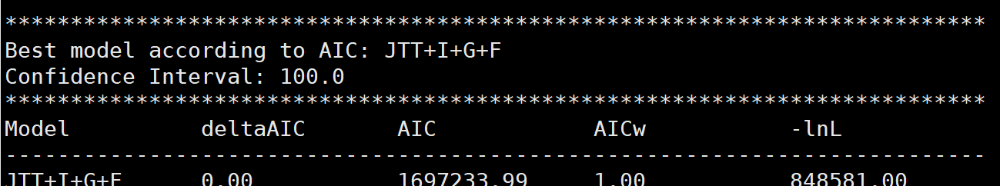

## 1.orthofinder介绍

 OrthoFinder是一种快速、准确和全面的比较基因组学分析工具。它可以找到直系和正群，为所有的正群推断基因树，并为所分析的物种推断一个有根的物种树。OrthoFinder还为比较基因组分析提供全面的统计数据。OrthoFinder使用简单，只需运行一组FASTA格式的蛋白质序列文件（每个物种一个）。

## 2.基础知识介绍

Orthologue（直系同源基因）指的是来自两个物种的基因。Orthologue是由两个物种的最后共同祖先(LCA)上的单个基因进化而来的成对基因(图1A和B)。正群是同源概念在物种群中的自然延伸。一个Orthogroup（正交群）是由一个物种的LCA中的单个基因进化而来的一组基因(图1A)。当观察基因树时，一个邻位群体中基因的第一次分化是一个物种形成事件，对同源基因来说也是如此。

作为基因复制事件的结果，当观察直系同源基因和正交群时，可能会有来自同一物种的多个基因。在这个例子中(图1A和B)，人类和老鼠的HuA基因是鸡中ChA1和ChA2的同源基因。再看一下正交群，我们发现有两个鸡的基因(图1A)，但是只有一个来自老鼠和人类的基因。一些作者将ChA1和ChA2基因作为HuA的共同源基因，以强调存在多个同源基因的事实。由于基因重复和丢失在进化中经常发生，一对一的直系同源物很少见，通过分析正交群所有直系同源的情况（一对一，多对一，多对多），我们可以分析数据的所有情况。

paralogues (旁系同源基因)是指在基因复制事件中从单个基因中分离出来的成对基因，鸡的两个基因ChA1和ChA2是旁系同源基因(图1C)。来自不同物种的两个基因如果在基因重复事件中彼此分离，也可能是同源的。由于基因树中所有的分支事件要么是物种形成事件(产生直系同源基因)，要么是重复事件(产生旁系同源基因)，因此同一正交群中任何不是直系同源基因的基因必然是旁系同源基因。


直系同源物是同源性基因，是物种形成事件的结果。Paralogs（旁系同源物)是同源基因，是重复事件的结果。可以看到(图2)，不同物种间的α-chain gene互为Orthologs(直系同源物)。正交群用来形容自一组物种的LCA中的单个基因的基因组（α-chain gene）。然后同一物种间α 和β chain gene互为Paralogs(旁系同源物)。最后所有这些关系都可以由OrthoFinder来识别。


## 3.安装

在这里推荐大家使用conda来安装，简单明了，不用担心其他Dependencies的安装

```bash
$conda install orthofinder
```

## 4.运行orthofinder

运行Orthofinder，相当简单的操作, "-f"输入目录，里面包含你需要运行的蛋白质fasta文件，“-t”所用到的CPU数目，“-S”选择的比对模式（默认diamod，可选blast）。

我使用的物种有九个：大豆（*G.max*）、菠萝（*A.comosus*）、柑橘（*C.sinensis*）、无油樟（*A.trichopoda*）、拟南芥（*A.thaliana*）、黄瓜（*C.sativus*）、水稻（*O.sativa*）、小立碗藓（*P.patens*）、江南卷柏（*S.moellendorffii*）

将所有物种的蛋白文件放到Angiospermae文件夹下

```bash
$nohup orthofinder -t 16 -f Angiospermae/ -S blast &
```

生成的结果会存储于Orthofinder/Results_XXX文件中，现在简单看看里面有啥。

```bash
Citation.txt                     Orthologues
Comparative_Genomics_Statistics  Phylogenetically_Misplaced_Genes
Gene_Duplication_Events          Putative_Xenologs
Gene_Trees                       Resolved_Gene_Trees
Log.txt                          Single_Copy_Orthologue_Sequences
Orthogroups                      Species_Tree
Orthogroup_Sequences             WorkingDirectory
```

我们主要使用Orthoogroups查看正交群的基因和使用 Single_Copy_Orthologue_Sequences里的单拷贝基因构建系统发育树

WorkingDirectory其中包含运算过程的中间文件，例如blast结果，如果我们想去掉某一物种，在SpeciesIDs.txt中将该物种注释掉

```bash
$vi SpeciesIDs.txt
#0: Acomosus.pro.fa
1: Athaliana.pro.fa
2: Atrichopoda.pro.fa
3: Csativus.pro.fa
4: Csinensis.pro.fa
5: Gmax.pro.fa
6: Osativa.pro.fa
7: Ppatens.pro.fa
8: Smoellendorffii.pro.fa
~                          
```

```bash
$nohup orthofinder -b WorkingDirectory
```

如果我们想增加额外的物种进行分析，可以按照如下方式运行

```bash
$nohup orthofinder -b WorkingDirectory -f new_fasta_directory
```

## 5.利用单拷贝基因构建系统发育树

Orthofinder的 Single_Copy_Orthologue_Sequences下存放着单拷贝同源基因的序列，我们可以利用这些序列构建系统发育树

### 5.1.多序列比对

多序列比对推荐使用muscle

```bash
$wget http://www.drive5.com/muscle/downloads3.8.31/muscle3.8.31_i86linux64.tar.gz
$tar xzvf muscle3.8.31_i86linux64.tar.gz
$chmod +x muscle
将muscle添加至环境变量
```

单拷贝的序列较多，所以使用shell批量运行

```bash
$vi bash.sh

for i in *.fa
do muscle -in $i -out $i.1
done

$sh bash.sh
```

### 5.2.提取保守序列

.1文件是比对好的序列文件，接下来使用Gblocks提取保守序列

```bash
$wget http://molevol.cmima.csic.es/castresana/Gblocks/Gblocks_Linux64_0.91b.tar.Z
$tar Zxf Gblocks_Linux64_0.91b.tar.Z
添加至环境变量
$vi bash2.sh
for i in *.1
do Gblocks $i -b4=5 -b5=h -t=p -e=.2
done
$sh bash2.sh
```
-t= default:p设置序列的类型，可选的值是 p,d,c 分别代表 protein， DNA， Codons 。
-b1= default:（ 序列条数的 50% + 1 ）,设定保守性位点必须有 >= 该值的序列数。该参数后接一个 integer 数，默认下比序列条数的 50% 大 1.
-b2= default: 序列条数的 85%,确定保守位点的侧翼位点时，其位点必须有 >= 该值的序列数。该值必须要比 -b1 的值要大。
-b3= default: 8,最大连续非保守位点的长度。
-b4= default: 10,保守位点区块的最小长度。该值必须 >=2 。
-b5= default: n, 设置允许含有 Gap 位点。可选的值有 n,h,a 分别代表 None, With Half, All 。 当为 h 时，表示
-e= default: .2, 设置输出结果的后缀。

### 5.3.序列合并

比对好之后我们需要将所有文件合并，在合并之前，需要对每个序列文件进行排序，并将多行序列转换为一行序列，此时用到的工具是seqkit

``` bash
$conda install seqkit
$vi bash3.sh
for i in *.2
do seqkit sort $i >$i.3
seqkit seq $i.3 -w 0 > $i.3.4
done
$sh bash3.sh
$mkdir new
$mv *.4 new/
$cd new
$paste -d " " *.4 > all.fa
$sed -i "s\ \\g" all.fa
```

此时我们已经把所有的单拷贝序列合并，接下来使用notepad++把所有的ID更改


### 5.4.选择合适的替代模型

修改结束后选择合适的氨基酸替代模型准备构建系统发育树，在这里我使用prottest预测合适的模型，prottest使用phy格式文件，所以用python脚本先将fa文件转换为phy文件，

```python
import re
with open('all.fa', 'r') as fin:
    sequences = [(m.group(1), ''.join(m.group(2).split()))
    for m in re.finditer(r'(?m)^>([^ \n]+)[^\n]*([^>]*)', fin.read())]
with open('all.phy', 'w') as fout:
    fout.write('%d %d\n' % (len(sequences), len(sequences[0][1])))
    for item in sequences:
        fout.write('%-20s %s\n' % item)
```

从[]官网上](https://www.softpedia.com/dyn-postdownload.php/cc45406e35260b47bfa4132e67f8c446/5f13ff63/286c7/4/1)下载prottest

```bash
$ tar zxf prottest-3.4-20140123.tar.gz
$java -jar /opt/biosoft/prottest-3.4-20140123/prottest-3.4.jar -i all.phy -all-distributions -F -AIC -BIC -tc 0.5 -threads 24 -o prottest.out
```

在prottest.out中可以看到最佳模型



### 5.5.构建系统发育树

使用raxml构建系统发育树

```bash
$wget https://github.com/stamatak/standard-RAxML/archive/master.zip
$unzip master.zip
$cd standard-RAxML
$make -f Makefile.SSE3.gcc
$make -f Makefile.SSE3.PTHREADS.gcc
$make -f Makefile.SSE3.MPI.gcc
$make -f Makefile.SSE3.HYBRID.gcc
添加至环境变量
```

选择JTT+I+G+F模型构建发育树，外群选择江南卷柏和小立碗藓

``` bash
$nohup raxmlHPC-PTHREADS-SSE3 -T 16 -f a -x 123 -p 123 -N 1000 -m PROTGAMMAJTT -k -O -o Smoellendorffii,Ppatens /
       -n all.tre -s all.fa &
```

运行结束后使用figtree打开RAxML_bipartitions.all.tre，对进化树进行修改。


至此，利用单拷贝基因构建系统进化已经完成


## 参考链接

[https://www.jianshu.com/p/16e0bbb2ba19](https://www.jianshu.com/p/16e0bbb2ba19)

[http://www.chenlianfu.com/?p=2217](http://www.chenlianfu.com/?p=2217)

[https://github.com/stamatak/standard-RAxML](https://github.com/stamatak/standard-RAxML)

[https://github.com/davidemms/OrthoFinder](https://github.com/davidemms/OrthoFinder)


转载请注明[周小钊的博客](www.zhouxiaozao.cn)>>[利用orthofinder寻找单拷贝基因构建系统发育树](www.zhouxiaozhao.cn/2020/07/18/orthofinder/)
