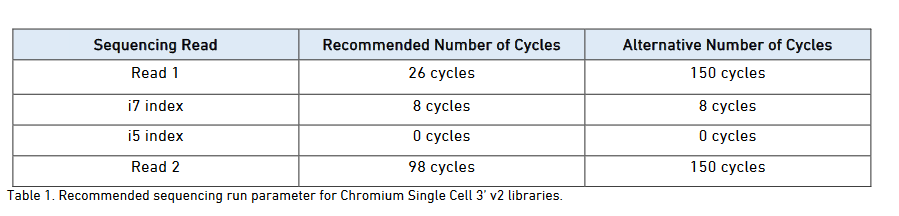

## 将SRA转为fastq

数据下载好之后，我们得到的是SRR文件，需要将其转换为fastq格式才能使用

```
wkd=/home/project/single-cell/MCC

cat SRR_Acc_List-2586-4.txt |while read i
do
fastq-dump --gzip --split-files ${i}.sra
done
```

结束之后每个SRR文件会变成解压出三个文件


为什么会有三个文件，这个需要去查一下[10X的官方说明](https://assets.ctfassets.net/an68im79xiti/1CnKSfa7taoQwIEe0WaA4m/8635b2c9ee86c022e731b6fb2e13fed2/CG000080_10x_Technical_Note_Base_Composition_SC3_v2_RevB.pdf)




可以看到Read1是26bp，主要是16bp的barcode和10bp的UMI，Read2的长度不固定，所以不一定是98bp，视情况而定，还有一个I7 index长度是8bp

接下来就按照10X的标准去对文件进行改名

```
cat SRR_Acc_List-9245-3.txt | while read i 
do 
mv ${i}_1*.gz${i}_S1_L001_I1_001.fastq.gz
mv ${i}_2*.gz ${i}_S1_L001_R1_001.fastq.gz
mv ${i}_3*.gz ${i}_S1_L001_R2_001.fastq.gz
done
```

之后我创建了文件夹将每个SRR数据的三个fastq文件放到一个文件夹下

```
SRR7722937
├── SRR7722937_S1_L001_I1_001.fastq.gz
├── SRR7722937_S1_L001_R1_001.fastq.gz
└── SRR7722937_S1_L001_R2_001.fastq.gz

```

## cellranger使用

下载cellranger3.1版本（目前cellranger已经支持4.0版本）并添加至环境变量


```
curl -o cellranger-3.1.0.tar.gz "https://cf.10xgenomics.com/releases/cell-exp/cellranger-3.1.0.tar.gz?Expires=1601922176&Policy=eyJTdGF0ZW1lbnQiOlt7IlJlc291cmNlIjoiaHR0cHM6Ly9jZi4xMHhnZW5vbWljcy5jb20vcmVsZWFzZXMvY2VsbC1leHAvY2VsbHJhbmdlci0zLjEuMC50YXIuZ3oiLCJDb25kaXRpb24iOnsiRGF0ZUxlc3NUaGFuIjp7IkFXUzpFcG9jaFRpbWUiOjE2MDE5MjIxNzZ9fX1dfQ__&Signature=mCC-emSQTqWg3i6Rm23lkuccNRI4z7xf-8bJ-O5gHqsYFJHDPZN9MeUZW5vhRZvmZhiGK7EDL4y~3xPtQbS6JtfUL9EFsoUxMywyF7tGN2ZlU2pbb2EVpmhKjmDWPVmvurDb~ZlHVYZCYcOc6gEHVtFRre-ICa7-nccVtnUJA-HvxNrZMs5mlQaUG9E-ngtbLi86gvIYlMHYnFRieZYpMA-kmUKrHGG8MhiuBGR96AWOrsVdTyMjD-BJOurGYvZGddWAF5uVXNPJs47FqF4fNCSQw71WOSRx4bQGdfb-jrOFp-NDSYFhkY1-gigku8VCx9phFCtyTAVM9yHeGN1oMQ__&Key-Pair-Id=APKAI7S6A5RYOXBWRPDA"
tar -zxvf cellranger-3.1.0.tar.gz
export PATH=/datadisk02/ScRNAseq/cellranger-3.1.0:$PATH
```

[构建注释](https://support.10xgenomics.com/single-cell-gene-expression/software/release-notes/build#grch38_3.0.0)

```
wget ftp://ftp.ensembl.org/pub/release-93/fasta/homo_sapiens/dna/Homo_sapiens.GRCh38.dna.primary_assembly.fa.gz
gunzip Homo_sapiens.GRCh38.dna.primary_assembly.fa.gz


wget ftp://ftp.ensembl.org/pub/release-93/gtf/homo_sapiens/Homo_sapiens.GRCh38.93.gtf.gz
gunzip Homo_sapiens.GRCh38.93.gtf.gz


cellranger mkgtf Homo_sapiens.GRCh38.93.gtf Homo_sapiens.GRCh38.93.filtered.gtf \
                 --attribute=gene_biotype:protein_coding \
                 --attribute=gene_biotype:lincRNA \
                 --attribute=gene_biotype:antisense \
                 --attribute=gene_biotype:IG_LV_gene \
                 --attribute=gene_biotype:IG_V_gene \
                 --attribute=gene_biotype:IG_V_pseudogene \
                 --attribute=gene_biotype:IG_D_gene \
                 --attribute=gene_biotype:IG_J_gene \
                 --attribute=gene_biotype:IG_J_pseudogene \
                 --attribute=gene_biotype:IG_C_gene \
                 --attribute=gene_biotype:IG_C_pseudogene \
                 --attribute=gene_biotype:TR_V_gene \
                 --attribute=gene_biotype:TR_V_pseudogene \
                 --attribute=gene_biotype:TR_D_gene \
                 --attribute=gene_biotype:TR_J_gene \
                 --attribute=gene_biotype:TR_J_pseudogene \
                 --attribute=gene_biotype:TR_C_gene


cellranger mkref --genome=GRCh38 \
                 --fasta=Homo_sapiens.GRCh38.dna.primary_assembly.fa \
                 --genes=Homo_sapiens.GRCh38.93.filtered.gtf \
                 --ref-version=3.0.0
                
```

也可以下载构建好的注释

```
curl -O https://cf.10xgenomics.com/supp/cell-exp/refdata-cellranger-GRCh38-3.0.0.tar.gz
```

然后进行比对即可

```
cellranger count --id=SRR937 --transcriptome=GRCh38 --fastqs=SRR7722937/ --sample=SRR7722937
```


在分析过程中可以发现有些命令比较眼熟，不难发现cellranger的比对还是构建索引其实都有STAR的影子，后续的话我将STARsolo（利用STAR分析单细胞数据）的流程再整理一下。

```
Generating STAR genome index (may take over 8 core hours for a 3Gb genome)...
15:12:38 ..... Started STAR run
15:12:38 ... Starting to generate Genome files
15:14:31 ... starting to sort  Suffix Array. This may take a long time...
15:14:41 ... sorting Suffix Array chunks and saving them to disk...
```


## 参考链接

[https://support.10xgenomics.com/single-cell-gene-expression/software/release-notes/build#grch38_3.0.0](https://support.10xgenomics.com/single-cell-gene-expression/software/release-notes/build#grch38_3.0.0)

[10x_Technical_Note_Base_Composition_SC3_v2_RevB.pdf](https://assets.ctfassets.net/an68im79xiti/1CnKSfa7taoQwIEe0WaA4m/8635b2c9ee86c022e731b6fb2e13fed2/CG000080_10x_Technical_Note_Base_Composition_SC3_v2_RevB.pdf)

[【生信技能树】使用10X单细胞转录组数据探索免疫治疗](https://www.bilibili.com/video/BV1xD4y1S74P)

[单细胞实战(三) Cell Ranger使用初探](https://mp.weixin.qq.com/s/6Jqu-20HasfHen6vRUSSBQ)

[单细胞实战(二) cell ranger使用前注意事项](https://mp.weixin.qq.com/s/fP8f4HboMM7m2Nd7AIljlg)