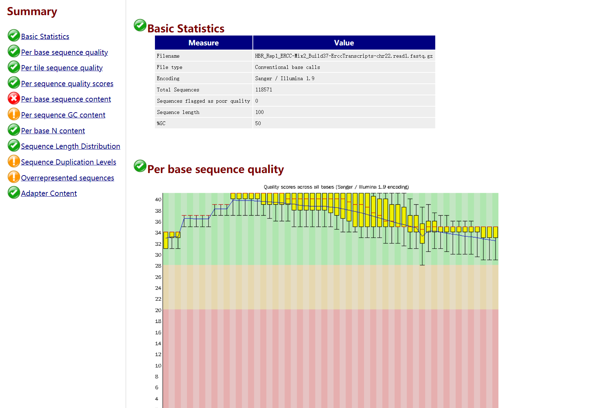

## 目录

**1.Module 1 - Introduction to RNA sequencing**

1. [Installation](https://www.zhouxiaozhao.cn/2020/11/17/RNAseq(1)/)
2. [Reference Genomes](https://www.zhouxiaozhao.cn/2020/11/28/RNAseq(2)/)
3. [Annotations](https://www.zhouxiaozhao.cn/2020/12/01/RNAseq(3)/)
4. [Indexing](https://www.zhouxiaozhao.cn/2020/12/03/RNAseq(4)/)
5. [RNA-seq Data](https://www.zhouxiaozhao.cn/2020/12/05/RNAseq(5)/)
6. [Pre-Alignment QC](https://www.zhouxiaozhao.cn/2020/12/08/RNAseq(6)/)

**2.Module 2 - RNA-seq Alignment and Visualization**

1. [Adapter Trim](https://www.zhouxiaozhao.cn/2020/12/10/RNAseq(7)/)
2. [Alignment](https://www.zhouxiaozhao.cn/2020/12/12/RNAseq(8)/)
3. [IGV](https://www.zhouxiaozhao.cn/2020/12/15/RNAseq(9)/)
4. [Alignment Visualization](https://www.zhouxiaozhao.cn/2020/12/17/RNAseq(10)/)
5. [Alignment QC](https://www.zhouxiaozhao.cn/2020/12/19/RNAseq(11)/)

**3.Module 3 - Expression and Differential Expression**

1. [Expression](https://www.zhouxiaozhao.cn/2020/12/22/RNAseq(12)/)
2. [Differential Expression](https://www.zhouxiaozhao.cn/2020/12/24/RNAseq(13)/)
3. [DE Visualization](https://www.zhouxiaozhao.cn/2020/12/26/RNAseq(14)/)
4. [Kallisto for Reference-Free Abundance Estimation](https://www.zhouxiaozhao.cn/2020/12/29/RNAseq(15)/)

**4.Module 4 - Isoform Discovery and Alternative Expression**

1. [Reference Guided Transcript Assembly](https://www.zhouxiaozhao.cn/2020/12/31/RNAseq(16)/)
2. [de novo Transcript Assembly](https://www.zhouxiaozhao.cn/2021/01/02/RNAseq(17)/)
3. [Transcript Assembly Merge](https://www.zhouxiaozhao.cn/2021/01/05/RNAseq(18)/)
4. [Differential Splicing](https://www.zhouxiaozhao.cn/2021/01/07/RNAseq(19)/)
5. [Splicing Visualization](https://www.zhouxiaozhao.cn/2021/01/09/RNAseq(20)/)

**5.Module 5 - De novo transcript reconstruction**

1. [De novo RNA-Seq Assembly and Analysis Using Trinity](https://www.zhouxiaozhao.cn/2021/01/12/RNAseq(21)/)

**6.Module 6 - Functional Annotation of Transcripts**

1. [Functional Annotation of Assembled Transcripts Using Trinotate](https://www.zhouxiaozhao.cn/2021/01/14/RNAseq(22)/)

## 1.6 Pre-Alignment QC

在对齐之前，你可以使用FastQC来确定你的数据质量:

http://www.bioinformatics.babraham.ac.uk/projects/fastqc/

还有一个视频教程

http://www.youtube.com/watch?v=bz93ReOv87Y

尝试在fastq文件上运行FastQC:

```
fastqc *.fastq.gz
```

查看一下结果

HBR_Rep1_ERCC-Mix2_Build37-ErccTranscripts-chr22.read1_fastqc.html



## 练习4

作业:在前面的实践练习中下载的其他fastq文件中运行FASTQC。

提示:请记住，将这些数据存储在一个名为“practice”的独立工作目录中。

在文件hcc1395_normal_1.fastq上运行FASTQC。并通过检查输出来回答这些问题。

问题

How many total sequences are there? 331,958

What is the range (x - y) of read lengths observed? 151

What is the most common average sequence quality score? 41

What does the Adaptor Content warning tell us? 有一些证据表明，Illumina接头在reads的3'端。这表明去除对于该数据来说可能是必须的。